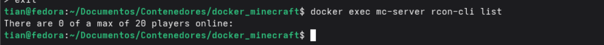
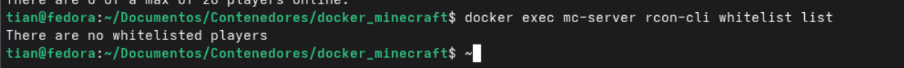

# Despliegue de un servidor de Minecraft 

Esta práctica es un proyecto didáctico que muestra cómo ejecutar y administrar un servidor de Minecraft (Java Edition) usando Docker. El repositorio incluye el fichero `docker-compose.yml` con la configuración mínima necesaria y una carpeta `screenshots/` con capturas que documentan el arranque del servidor, la consola administrativa (RCON) y aspectos de gestión como usuarios y whitelist. Está pensado para aprender los pasos básicos de despliegue y diagnóstico visual a partir de ejemplos reales.

### Objetivo

El objetivo del ejercicio es ilustrar, con ejemplos visuales, el despliegue y la administración básica de un servidor de Minecraft ejecutado en un contenedor Docker. Las capturas muestran la fase de arranque del servidor, la consola administrativa (RCON), la comprobación de usuarios y el estado de la whitelist.

A continuación se muestran las capturas incluidas en el repositorio. Cada imagen tiene una breve descripción de lo que representa y qué debes comprobar cuando realices el despliegue:

1) `screenshots/docker_mc-serve.png`

Descripción: captura de los mensajes del servidor durante el arranque y la generación del mundo.

Qué ver y por qué importa:
- Busca líneas que indiquen la creación de los directorios de mundo y la carga de recursos. Estas líneas confirman que el servidor está construyendo el entorno correctamente.
- El mensaje final que habitualmente indica que el servidor está listo suele contener la palabra "Done" y confirma que el servidor aceptó la configuración y arrancó sin errores críticos.
- Si observas errores relacionados con Java o permisos en esta pantalla, significa que hay un problema en la imagen o en las rutas montadas y conviene revisarlas.

2) `screenshots/rcon_cli.png`

Descripción: ejemplo de la consola `rcon-cli` ejecutada dentro del contenedor (consola administrativa del servidor).

Qué ver y por qué importa:
- Muestra cómo enviar comandos al servidor (por ejemplo, cambiar el modo de juego, teletransportar jugadores o hacerlos OP).
- Observa los mensajes de confirmación que devuelve el servidor al ejecutar comandos; son la forma más directa de comprobar que una orden se ha aplicado correctamente.
- Si la consola responde con errores de autenticación o con respuestas vacías, revisa la configuración de RCON (`RCON_PASSWORD`, `RCON_PORT`) y que el servicio interno esté escuchando.

3) `screenshots/check_user_list.png`

Descripción: muestra la verificación de la lista de usuarios conectados u otra información de estado del servidor.

Qué ver y por qué importa:
- Permite comprobar quién está conectado y confirmar que la IP/puerto del servidor están accesibles para los jugadores.
- Es útil para monitorizar sesiones activas y detectar problemas de conexión desde el lado del servidor.
- Si la lista está vacía y esperabas jugadores, revisa los logs de conexión en `docker_mc-serve.png` y la configuración de red del host.

4) `screenshots/empty_whitelist.png`

Descripción: ejemplo visual de una whitelist vacía o del estado de permisos/whitelist del servidor.

Qué ver y por qué importa:
- Indica si el servidor está configurado para permitir solo jugadores listados (whitelist habilitada) o no.
- Una whitelist vacía con la whitelist activada bloqueará el acceso de jugadores no incluidos; asegúrate de añadir los usuarios necesarios si ese es el comportamiento deseado.
